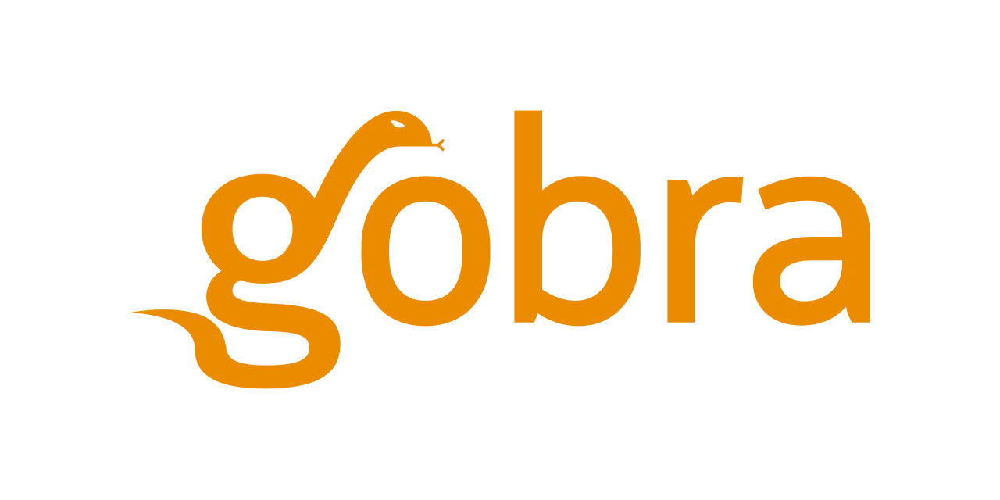

Gobra IDE directly integrates verification with Gobra into VSCode.

**Note:** Gobra as well as Gobra IDE are both prototypes and under active development.

## First Usage
1. Install the [requirements](#requirements)
2. Install [this extension](https://marketplace.visualstudio.com/items?itemName=viper-admin.gobra-ide) from the Visual Studio Marketplace
3. Open a Gobra or Go file to activate this extension. At the first activation, this extension will download Gobra automatically.

Opening or modifying a Gobra program (file extension `.gobra`) will automatically trigger its verification.
In addition, you can manually start a verification in the command palette (View -> Command Palette, or Shift+Ctrl+P on Ubuntu) by running the command `Gobra: Verify currently opened File`.
You should see a message "Verification of ..." in the status bar while Gobra is running. 
The result of the verification is then reported in the status bar and in the "Problems" tab (open it with View -> Problems).

To update Gobra, run the command `Gobra: Update Gobra Tools` in the command palette.

## Features
### Verification of Go programs
Verification of Go programs (file extension `.go`) is supported by this extension as well.
The specification has to be located in comments either starting with `//@` or starting and ending with `/*@` resp. `@*/`.

Note that automatic verification is not supported for `.go` programs.
You have to manually invoke a verification in the command palette using the command `Gobra: Verify currently opened File`.

A Gobra program can be converted to a Go program and back by running the commands `Gobra: Goify currently opened File` and `Gobra: Gobrafy currently opened File`, respectively.

### Verification Result Caching
This extension caches verification results by default.
The cache can be flushed by running the command `Gobra: Flush Viper Server Cache` from the command palette.

### Show Intermediate Representations
Right clicking on some selected code in a Gobra program reveals two actions "Show Internal Representation Preview" and "Show Viper Code Preview", both result in a preview of the internal representation used by Gobra resp. the resulting code in the Viper intermediate language on the right hand side.
The translated parts of the selected code are marked in green.

## Requirements
- [Java Runtime Environment (or JDK), 64 bit, version 1.8 or later](https://www.java.com/en/download/)
